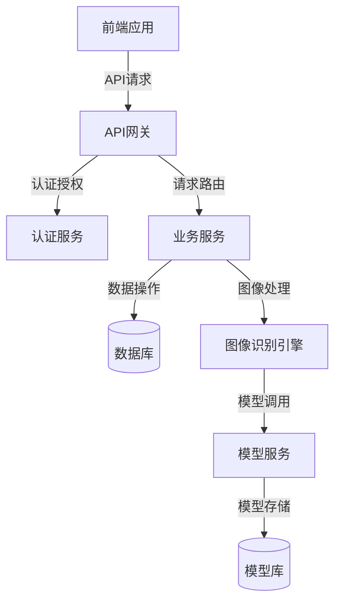

# 图像识别引擎系统 - 后端开发文档

## 目录

- [1. 系统概述](#1-系统概述)
  - [1.1 系统架构](#11-系统架构)
  - [1.2 技术栈](#12-技术栈)
  - [1.3 环境要求](#13-环境要求)
- [2. API接口设计](#2-api接口设计)
  - [2.1 接口规范](#21-接口规范)
  - [2.2 认证机制](#22-认证机制)
  - [2.3 管理员端接口](#23-管理员端接口)
  - [2.4 客户端接口](#24-客户端接口)
- [3. 数据库设计](#3-数据库设计)
  - [3.1 数据库架构](#31-数据库架构)
  - [3.2 表结构设计](#32-表结构设计)
  - [3.3 索引设计](#33-索引设计)
- [4. 安全设计](#4-安全设计)
  - [4.1 认证与授权](#41-认证与授权)
  - [4.2 数据加密](#42-数据加密)
  - [4.3 API安全](#43-api安全)
- [5. 部署指南](#5-部署指南)
  - [5.1 环境配置](#51-环境配置)
  - [5.2 部署流程](#52-部署流程)
  - [5.3 监控与维护](#53-监控与维护)

## 1. 系统概述

### 1.1 系统架构

图像识别引擎系统采用前后端分离的架构设计，后端提供RESTful API接口，前端通过API调用获取数据并展示。



### 1.2 技术栈

- **编程语言**：Go
- **Web框架**：Gin/Echo（高性能Web框架）
- **数据库**：MongoDB（文档存储）+ MySQL（关系数据）
- **缓存**：Redis
- **消息队列**：RabbitMQ
- **图像处理**：GoCV（OpenCV的Go绑定）, TensorFlow/PyTorch的Go接口
- **认证**：JWT (JSON Web Token)
- **文档**：Swagger/OpenAPI
- **部署**：Docker, Kubernetes

### 1.3 环境要求

- Go >= 1.20
- MongoDB >= 5.0
- MySQL >= 8.0
- Redis >= 6.0
- 操作系统：Linux (推荐 Ubuntu 20.04 LTS)
- 内存：>= 8GB (生产环境推荐 16GB+)
- CPU：>= 4核 (生产环境推荐 8核+)
- GPU：用于模型训练和推理 (NVIDIA GPU with CUDA support)

## 2. API接口设计

### 2.1 接口规范

#### 基础URL

```
https://api.example.com/v1
```

#### 请求格式

- 请求体格式：JSON
- 内容类型：`application/json`

#### 响应格式

所有API响应均遵循以下格式：

```json
{
  "code": 200,          // 状态码
  "message": "成功",   // 状态描述
  "data": {           // 响应数据
    // 具体数据字段
  }
}
```

#### 状态码

| 状态码 | 描述 |
|--------|------|
| 200 | 请求成功 |
| 400 | 请求参数错误 |
| 401 | 认证失败 |
| 403 | 权限不足 |
| 404 | 资源不存在 |
| 429 | 请求过于频繁 |
| 500 | 服务器内部错误 |

### 2.2 认证机制

系统采用两种认证方式：

1. **管理员端认证**：基于JWT (JSON Web Token)
2. **客户端API认证**：基于AppID和API密钥

#### JWT认证流程

```mermaid
sequenceDiagram
    参与者 A as 客户端
    参与者 B as 认证服务
    参与者 C as API服务
    A->>B: 发送登录请求(用户名/密码)
    B->>B: 验证凭据
    B->>A: 返回JWT令牌
    A->>C: API请求(携带JWT令牌)
    C->>C: 验证JWT令牌
    C->>A: 返回请求结果
```

#### API密钥认证

客户端API调用需要在请求头中包含以下字段：

```
X-App-ID: 应用ID
X-API-Key: API密钥
```

### 2.3 管理员端接口

#### 2.3.1 系统管理

##### 系统参数配置

**获取系统参数列表**

- **URL**: `/admin/system/params`
- **方法**: `GET`
- **权限**: 系统管理员
- **请求参数**:

| 参数名 | 类型 | 必填 | 描述 |
|--------|------|------|------|
| page | Integer | 否 | 页码，默认1 |
| pageSize | Integer | 否 | 每页条数，默认20 |
| keyword | String | 否 | 搜索关键词 |

- **响应示例**:

```json
{
  "code": 200,
  "message": "成功",
  "data": {
    "total": 5,
    "items": [
      {
        "id": "1",
        "name": "超级管理员",
        "description": "系统最高权限角色",
        "permissions": ["all"],
        "createTime": "2023-01-01T00:00:00Z",
        "updateTime": "2023-01-01T00:00:00Z"
      },
      {
        "id": "2",
        "name": "系统管理员",
        "description": "系统管理权限",
        "permissions": ["system:read", "system:write"],
        "createTime": "2023-01-01T00:00:00Z",
        "updateTime": "2023-01-01T00:00:00Z"
      }
    ]
  }
}
```

**创建角色**

- **URL**: `/admin/auth/roles`
- **方法**: `POST`
- **权限**: 超级管理员
- **请求参数**:

| 参数名 | 类型 | 必填 | 描述 |
|--------|------|------|------|
| name | String | 是 | 角色名称 |
| description | String | 否 | 角色描述 |
| permissions | Array | 是 | 权限列表 |

- **响应示例**:

```json
{
  "code": 200,
  "message": "创建成功",
  "data": {
    "id": "3",
    "name": "数据分析师",
    "description": "数据分析权限",
    "permissions": ["stats:read"],
    "createTime": "2024-01-03T00:00:00Z",
    "updateTime": "2024-01-03T00:00:00Z"
  }
}
```

##### 权限管理

**获取权限列表**

- **URL**: `/admin/auth/permissions`
- **方法**: `GET`
- **权限**: 系统管理员
- **请求参数**:

| 参数名 | 类型 | 必填 | 描述 |
|--------|------|------|------|
| page | Integer | 否 | 页码，默认1 |
| pageSize | Integer | 否 | 每页条数，默认20 |
| module | String | 否 | 模块名称 |

- **响应示例**:

```json
{
  "code": 200,
  "message": "成功",
  "data": {
    "total": 20,
    "items": [
      {
        "id": "1",
        "code": "system:read",
        "name": "系统管理查看权限",
        "module": "system",
        "description": "允许查看系统管理相关信息"
      },
      {
        "id": "2",
        "code": "system:write",
        "name": "系统管理编辑权限",
        "module": "system",
        "description": "允许编辑系统管理相关信息"
      }
    ]
  }
}
```

#### 2.3.3 模型管理

##### 模型版本管理

**获取模型版本列表**

- **URL**: `/admin/models/versions`
- **方法**: `GET`
- **权限**: 模型管理员
- **请求参数**:

| 参数名 | 类型 | 必填 | 描述 |
|--------|------|------|------|
| page | Integer | 否 | 页码，默认1 |
| pageSize | Integer | 否 | 每页条数，默认20 |
| status | String | 否 | 状态(development/testing/production) |

- **响应示例**:

```json
{
  "code": 200,
  "message": "成功",
  "data": {
    "total": 3,
    "items": [
      {
        "id": "1",
        "version": "v1.0.0",
        "description": "初始版本",
        "releaseDate": "2024-01-01",
        "status": "production",
        "accuracy": 0.85,
        "parameters": {
          "batchSize": 32,
          "learningRate": 0.001,
          "epochs": 100
        },
        "createTime": "2024-01-01T00:00:00Z",
        "updateTime": "2024-01-01T00:00:00Z"
      }
    ]
  }
}
```

**上传新模型版本**

- **URL**: `/admin/models/versions`
- **方法**: `POST`
- **权限**: 模型管理员
- **请求参数**:

| 参数名 | 类型 | 必填 | 描述 |
|--------|------|------|------|
| version | String | 是 | 版本号 |
| description | String | 是 | 版本描述 |
| status | String | 是 | 状态(development/testing/production) |
| modelFile | File | 是 | 模型文件 |
| parameters | Object | 是 | 模型参数 |

- **响应示例**:

```json
{
  "code": 200,
  "message": "上传成功",
  "data": {
    "id": "4",
    "version": "v1.3.0",
    "description": "新增特征优化",
    "releaseDate": "2024-01-25",
    "status": "development",
    "parameters": {
      "batchSize": 128,
      "learningRate": 0.0002,
      "epochs": 250
    },
    "createTime": "2024-01-25T00:00:00Z"
  }
}
```

##### 训练参数配置

**获取训练参数列表**

- **URL**: `/admin/models/params`
- **方法**: `GET`
- **权限**: 模型管理员
- **请求参数**:

| 参数名 | 类型 | 必填 | 描述 |
|--------|------|------|------|
| page | Integer | 否 | 页码，默认1 |
| pageSize | Integer | 否 | 每页条数，默认20 |
| modelId | String | 否 | 模型ID |

- **响应示例**:

```json
{
  "code": 200,
  "message": "成功",
  "data": {
    "total": 10,
    "items": [
      {
        "id": "1",
        "name": "batchSize",
        "displayName": "批处理大小",
        "value": "128",
        "type": "number",
        "range": "32,64,128,256",
        "description": "训练时的批处理大小",
        "modelId": "1"
      },
      {
        "id": "2",
        "name": "learningRate",
        "displayName": "学习率",
        "value": "0.001",
        "type": "number",
        "range": "0.0001,0.001,0.01",
        "description": "模型训练学习率",
        "modelId": "1"
      }
    ]
  }
}
```

**更新训练参数**

- **URL**: `/admin/models/params/:id`
- **方法**: `PUT`
- **权限**: 模型管理员
- **请求参数**:

| 参数名 | 类型 | 必填 | 描述 |
|--------|------|------|------|
| value | String | 是 | 参数值 |

- **响应示例**:

```json
{
  "code": 200,
  "message": "更新成功",
  "data": {
    "id": "1",
    "name": "batchSize",
    "displayName": "批处理大小",
    "value": "256",
    "type": "number",
    "range": "32,64,128,256",
    "description": "训练时的批处理大小",
    "modelId": "1",
    "updateTime": "2024-01-25T00:00:00Z"
  }
}
```

##### 性能监控

**获取模型性能数据**

- **URL**: `/admin/models/performance`
- **方法**: `GET`
- **权限**: 模型管理员
- **请求参数**:

| 参数名 | 类型 | 必填 | 描述 |
|--------|------|------|------|
| modelId | String | 是 | 模型ID |
| startTime | String | 否 | 开始时间 |
| endTime | String | 否 | 结束时间 |
| metrics | String | 否 | 指标类型(accuracy/latency/throughput) |

- **响应示例**:

```json
{
  "code": 200,
  "message": "成功",
  "data": {
    "modelId": "1",
    "modelVersion": "v1.0.0",
    "metrics": {
      "accuracy": [
        {"timestamp": "2024-01-01T00:00:00Z", "value": 0.85},
        {"timestamp": "2024-01-02T00:00:00Z", "value": 0.86}
      ],
      "latency": [
        {"timestamp": "2024-01-01T00:00:00Z", "value": 120},
        {"timestamp": "2024-01-02T00:00:00Z", "value": 115}
      ],
      "throughput": [
        {"timestamp": "2024-01-01T00:00:00Z", "value": 100},
        {"timestamp": "2024-01-02T00:00:00Z", "value": 105}
      ]
    }
  }
}
```

#### 2.3.4 数据统计

##### 系统使用统计

**获取系统使用统计数据**

- **URL**: `/admin/stats/system`
- **方法**: `GET`
- **权限**: 统计查看权限
- **请求参数**:

| 参数名 | 类型 | 必填 | 描述 |
|--------|------|------|------|
| startTime | String | 否 | 开始时间 |
| endTime | String | 否 | 结束时间 |
| interval | String | 否 | 统计间隔(hour/day/week/month) |

- **响应示例**:

```json
{
  "code": 200,
  "message": "成功",
  "data": {
    "totalRequests": 1000000,
    "totalUsers": 500,
    "activeUsers": 300,
    "requestsChart": [
      {"date": "2024-01-01", "value": 50000},
      {"date": "2024-01-02", "value": 52000}
    ],
    "usersChart": [
      {"date": "2024-01-01", "value": 280},
      {"date": "2024-01-02", "value": 300}
    ]
  }
}
```

##### 识别准确率分析

**获取识别准确率数据**

- **URL**: `/admin/stats/accuracy`
- **方法**: `GET`
- **权限**: 统计查看权限
- **请求参数**:

| 参数名 | 类型 | 必填 | 描述 |
|--------|------|------|------|
| modelId | String | 否 | 模型ID |
| startTime | String | 否 | 开始时间 |
| endTime | String | 否 | 结束时间 |
| category | String | 否 | 图像类别 |

- **响应示例**:

```json
{
  "code": 200,
  "message": "成功",
  "data": {
    "overallAccuracy": 0.87,
    "categoryAccuracy": [
      {"category": "人脸", "accuracy": 0.92},
      {"category": "物体", "accuracy": 0.85},
      {"category": "场景
```

### 2.4 客户端接口

#### 2.4.1 图像识别

##### 图像识别请求

- **URL**: `/api/v1/recognition`
- **方法**: `POST`
- **认证**: 需要API密钥认证
- **请求参数**:

| 参数名 | 类型 | 必填 | 描述 |
|--------|------|------|------|
| image | File/URL | 是 | 图片文件或图片URL |
| mode | String | 否 | 识别模式(normal/fast/accurate)，默认normal |
| returnLabels | Boolean | 否 | 是否返回标签列表，默认true |
| minConfidence | Float | 否 | 最小置信度阈值(0-1)，默认0.5 |

- **请求示例**:

```json
{
  "image": "https://example.com/image.jpg",
  "mode": "normal",
  "returnLabels": true,
  "minConfidence": 0.6
}
```

- **响应示例**:

```json
{
  "code": 200,
  "message": "识别成功",
  "data": {
    "requestId": "req_123456789",
    "processingTime": 235,
    "result": {
      "labels": [
        {
          "name": "猫",
          "confidence": 0.95,
          "category": "动物"
        },
        {
          "name": "宠物",
          "confidence": 0.88,
          "category": "类别"
        }
      ],
      "mainCategory": "动物",
      "imageQuality": {
        "brightness": 0.75,
        "clarity": 0.82
      }
    }
  }
}
```

##### 识别历史查询

- **URL**: `/api/v1/recognition/history`
- **方法**: `GET`
- **认证**: 需要API密钥认证
- **请求参数**:

| 参数名 | 类型 | 必填 | 描述 |
|--------|------|------|------|
| page | Integer | 否 | 页码，默认1 |
| pageSize | Integer | 否 | 每页条数，默认20 |
| startDate | String | 否 | 开始日期(YYYY-MM-DD) |
| endDate | String | 否 | 结束日期(YYYY-MM-DD) |
| status | String | 否 | 状态(success/failed) |

- **响应示例**:

```json
{
  "code": 200,
  "message": "成功",
  "data": {
    "total": 50,
    "items": [
      {
        "requestId": "req_123456789",
        "imageUrl": "https://example.com/image.jpg",
        "status": "success",
        "processingTime": 235,
        "result": {
          "mainCategory": "动物",
          "topLabel": "猫",
          "confidence": 0.95
        },
        "createTime": "2024-01-25T10:30:00Z"
      }
    ]
  }
}
```

#### 2.4.2 API使用统计

##### 获取使用统计

- **URL**: `/api/v1/stats/usage`
- **方法**: `GET`
- **认证**: 需要API密钥认证
- **请求参数**:

| 参数名 | 类型 | 必填 | 描述 |
|--------|------|------|------|
| period | String | 否 | 统计周期(day/week/month)，默认day |
| startDate | String | 否 | 开始日期(YYYY-MM-DD) |
| endDate | String | 否 | 结束日期(YYYY-MM-DD) |

- **响应示例**:

```json
{
  "code": 200,
  "message": "成功",
  "data": {
    "totalCalls": 1500,
    "successRate": 0.98,
    "averageLatency": 245,
    "usage": [
      {
        "date": "2024-01-25",
        "calls": 150,
        "successCount": 147,
        "failureCount": 3,
        "averageLatency": 238
      }
    ],
    "quotaInfo": {
      "totalQuota": 10000,
      "usedQuota": 1500,
      "remainingQuota": 8500
    }
  }
}
```

##### 识别准确率分析

**获取识别准确率数据**

- **URL**: `/admin/stats/accuracy`
- **方法**: `GET`
- **权限**: 统计查看权限
- **请求参数**:

| 参数名 | 类型 | 必填 | 描述 |
|--------|------|------|------|
| modelId | String | 否 | 模型ID |
| startTime | String | 否 | 开始时间 |
| endTime | String | 否 | 结束时间 |
| category | String | 否 | 图像类别 |

- **响应示例**:

```json
{
  "code": 200,
  "message": "成功",
  "data": {
    "overallAccuracy": 0.87,
    "categoryAccuracy": [
      {"category": "人脸", "accuracy": 0.92},
      {"category": "物体", "accuracy": 0.85},
      {"category": "场景 Integer | 否 | 每页条数，默认20 |
| keyword | String | 否 | 搜索关键词 |

- **响应示例**:

```json
{
  "code": 200,
  "message": "成功",
  "data": {
    "total": 100,
    "items": [
      {
        "id": "1",
        "key": "max_concurrent_requests",
        "value": "100",
        "description": "最大并发请求数",
        "type": "number",
        "createTime": "2024-01-01T00:00:00Z",
        "updateTime": "2024-01-01T00:00:00Z"
      }
    ]
  }
}
```

**更新系统参数**

- **URL**: `/admin/system/params/:id`
- **方法**: `PUT`
- **权限**: 系统管理员
- **请求参数**:

| 参数名 | 类型 | 必填 | 描述 |
|--------|------|------|------|
| value | String | 是 | 参数值 |

- **响应示例**:

```json
{
  "code": 200,
  "message": "更新成功",
  "data": {
    "id": "1",
    "key": "max_concurrent_requests",
    "value": "200",
    "description": "最大并发请求数",
    "type": "number",
    "createTime": "2024-01-01T00:00:00Z",
    "updateTime": "2024-01-02T00:00:00Z"
  }
}
```

##### 服务器监控

**获取服务器状态**

- **URL**: `/admin/system/monitor`
- **方法**: `GET`
- **权限**: 系统管理员
- **响应示例**:

```json
{
  "code": 200,
  "message": "成功",
  "data": {
    "cpu": {
      "usage": 45.5,
      "cores": 8
    },
    "memory": {
      "total": 16384,
      "used": 8192,
      "free": 8192
    },
    "disk": {
      "total": 1024000,
      "used": 512000,
      "free": 512000
    },
    "network": {
      "in": 1024,
      "out": 2048
    },
    "uptime": 86400
  }
}
```

##### 日志管理

**获取系统日志**

- **URL**: `/admin/system/logs`
- **方法**: `GET`
- **权限**: 系统管理员
- **请求参数**:

| 参数名 | 类型 | 必填 | 描述 |
|--------|------|------|------|
| page | Integer | 否 | 页码，默认1 |
| pageSize | Integer | 否 | 每页条数，默认20 |
| keyword | String | 否 | 搜索关键词 |

- **响应示例**:

```json
{
  "code": 200,
  "message": "成功",
  "data": {
    "total": 5,
    "items": [
      {
        "id": "1",
        "name": "超级管理员",
        "description": "系统最高权限角色",
        "permissions": ["all"],
        "createTime": "2023-01-01T00:00:00Z",
        "updateTime": "2023-01-01T00:00:00Z"
      },
      {
        "id": "2",
        "name": "系统管理员",
        "description": "系统管理权限",
        "permissions": ["system:read", "system:write"],
        "createTime": "2023-01-01T00:00:00Z",
        "updateTime": "2023-01-01T00:00:00Z"
      }
    ]
  }
}
```

**创建角色**

- **URL**: `/admin/auth/roles`
- **方法**: `POST`
- **权限**: 超级管理员
- **请求参数**:

| 参数名 | 类型 | 必填 | 描述 |
|--------|------|------|------|
| name | String | 是 | 角色名称 |
| description | String | 否 | 角色描述 |
| permissions | Array | 是 | 权限列表 |

- **响应示例**:

```json
{
  "code": 200,
  "message": "创建成功",
  "data": {
    "id": "3",
    "name": "数据分析师",
    "description": "数据分析权限",
    "permissions": ["stats:read"],
    "createTime": "2024-01-03T00:00:00Z",
    "updateTime": "2024-01-03T00:00:00Z"
  }
}
```

##### 权限管理

**获取权限列表**

- **URL**: `/admin/auth/permissions`
- **方法**: `GET`
- **权限**: 系统管理员
- **请求参数**:

| 参数名 | 类型 | 必填 | 描述 |
|--------|------|------|------|
| page | Integer | 否 | 页码，默认1 |
| pageSize | Integer | 否 | 每页条数，默认20 |
| module | String | 否 | 模块名称 |

- **响应示例**:

```json
{
  "code": 200,
  "message": "成功",
  "data": {
    "total": 20,
    "items": [
      {
        "id": "1",
        "code": "system:read",
        "name": "系统管理查看权限",
        "module": "system",
        "description": "允许查看系统管理相关信息"
      },
      {
        "id": "2",
        "code": "system:write",
        "name": "系统管理编辑权限",
        "module": "system",
        "description": "允许编辑系统管理相关信息"
      }
    ]
  }
}
```

#### 2.3.3 模型管理

##### 模型版本管理

**获取模型版本列表**

- **URL**: `/admin/models/versions`
- **方法**: `GET`
- **权限**: 模型管理员
- **请求参数**:

| 参数名 | 类型 | 必填 | 描述 |
|--------|------|------|------|
| page | Integer | 否 | 页码，默认1 |
| pageSize | Integer | 否 | 每页条数，默认20 |
| status | String | 否 | 状态(development/testing/production) |

- **响应示例**:

```json
{
  "code": 200,
  "message": "成功",
  "data": {
    "total": 3,
    "items": [
      {
        "id": "1",
        "version": "v1.0.0",
        "description": "初始版本",
        "releaseDate": "2024-01-01",
        "status": "production",
        "accuracy": 0.85,
        "parameters": {
          "batchSize": 32,
          "learningRate": 0.001,
          "epochs": 100
        },
        "createTime": "2024-01-01T00:00:00Z",
        "updateTime": "2024-01-01T00:00:00Z"
      }
    ]
  }
}
```

**上传新模型版本**

- **URL**: `/admin/models/versions`
- **方法**: `POST`
- **权限**: 模型管理员
- **请求参数**:

| 参数名 | 类型 | 必填 | 描述 |
|--------|------|------|------|
| version | String | 是 | 版本号 |
| description | String | 是 | 版本描述 |
| status | String | 是 | 状态(development/testing/production) |
| modelFile | File | 是 | 模型文件 |
| parameters | Object | 是 | 模型参数 |

- **响应示例**:

```json
{
  "code": 200,
  "message": "上传成功",
  "data": {
    "id": "4",
    "version": "v1.3.0",
    "description": "新增特征优化",
    "releaseDate": "2024-01-25",
    "status": "development",
    "parameters": {
      "batchSize": 128,
      "learningRate": 0.0002,
      "epochs": 250
    },
    "createTime": "2024-01-25T00:00:00Z"
  }
}
```

##### 训练参数配置

**获取训练参数列表**

- **URL**: `/admin/models/params`
- **方法**: `GET`
- **权限**: 模型管理员
- **请求参数**:

| 参数名 | 类型 | 必填 | 描述 |
|--------|------|------|------|
| page | Integer | 否 | 页码，默认1 |
| pageSize | Integer | 否 | 每页条数，默认20 |
| modelId | String | 否 | 模型ID |

- **响应示例**:

```json
{
  "code": 200,
  "message": "成功",
  "data": {
    "total": 10,
    "items": [
      {
        "id": "1",
        "name": "batchSize",
        "displayName": "批处理大小",
        "value": "128",
        "type": "number",
        "range": "32,64,128,256",
        "description": "训练时的批处理大小",
        "modelId": "1"
      },
      {
        "id": "2",
        "name": "learningRate",
        "displayName": "学习率",
        "value": "0.001",
        "type": "number",
        "range": "0.0001,0.001,0.01",
        "description": "模型训练学习率",
        "modelId": "1"
      }
    ]
  }
}
```

**更新训练参数**

- **URL**: `/admin/models/params/:id`
- **方法**: `PUT`
- **权限**: 模型管理员
- **请求参数**:

| 参数名 | 类型 | 必填 | 描述 |
|--------|------|------|------|
| value | String | 是 | 参数值 |

- **响应示例**:

```json
{
  "code": 200,
  "message": "更新成功",
  "data": {
    "id": "1",
    "name": "batchSize",
    "displayName": "批处理大小",
    "value": "256",
    "type": "number",
    "range": "32,64,128,256",
    "description": "训练时的批处理大小",
    "modelId": "1",
    "updateTime": "2024-01-25T00:00:00Z"
  }
}
```

##### 性能监控

**获取模型性能数据**

- **URL**: `/admin/models/performance`
- **方法**: `GET`
- **权限**: 模型管理员
- **请求参数**:

| 参数名 | 类型 | 必填 | 描述 |
|--------|------|------|------|
| modelId | String | 是 | 模型ID |
| startTime | String | 否 | 开始时间 |
| endTime | String | 否 | 结束时间 |
| metrics | String | 否 | 指标类型(accuracy/latency/throughput) |

- **响应示例**:

```json
{
  "code": 200,
  "message": "成功",
  "data": {
    "modelId": "1",
    "modelVersion": "v1.0.0",
    "metrics": {
      "accuracy": [
        {"timestamp": "2024-01-01T00:00:00Z", "value": 0.85},
        {"timestamp": "2024-01-02T00:00:00Z", "value": 0.86}
      ],
      "latency": [
        {"timestamp": "2024-01-01T00:00:00Z", "value": 120},
        {"timestamp": "2024-01-02T00:00:00Z", "value": 115}
      ],
      "throughput": [
        {"timestamp": "2024-01-01T00:00:00Z", "value": 100},
        {"timestamp": "2024-01-02T00:00:00Z", "value": 105}
      ]
    }
  }
}
```

#### 2.3.4 数据统计

##### 系统使用统计

**获取系统使用统计数据**

- **URL**: `/admin/stats/system`
- **方法**: `GET`
- **权限**: 统计查看权限
- **请求参数**:

| 参数名 | 类型 | 必填 | 描述 |
|--------|------|------|------|
| startTime | String | 否 | 开始时间 |
| endTime | String | 否 | 结束时间 |
| interval | String | 否 | 统计间隔(hour/day/week/month) |

- **响应示例**:

```json
{
  "code": 200,
  "message": "成功",
  "data": {
    "totalRequests": 1000000,
    "totalUsers": 500,
    "activeUsers": 300,
    "requestsChart": [
      {"date": "2024-01-01", "value": 50000},
      {"date": "2024-01-02", "value": 52000}
    ],
    "usersChart": [
      {"date": "2024-01-01", "value": 280},
      {"date": "2024-01-02", "value": 300}
    ]
  }
}
```

##### 识别准确率分析

**获取识别准确率数据**

- **URL**: `/admin/stats/accuracy`
- **方法**: `GET`
- **权限**: 统计查看权限
- **请求参数**:

| 参数名 | 类型 | 必填 | 描述 |
|--------|------|------|------|
| modelId | String | 否 | 模型ID |
| startTime | String | 否 | 开始时间 |
| endTime | String | 否 | 结束时间 |
| category | String | 否 | 图像类别 |

- **响应示例**:

```json
{
  "code": 200,
  "message": "成功",
  "data": {
    "overallAccuracy": 0.87,
    "categoryAccuracy": [
      {"category": "人脸", "accuracy": 0.92},
      {"category": "物体", "accuracy": 0.85},
      {"category": "场景 Integer | 否 | 每页条数，默认20 |
| level | String | 否 | 日志级别(info/warn/error) |
| startTime | String | 否 | 开始时间 |
| endTime | String | 否 | 结束时间 |
| keyword | String | 否 | 搜索关键词 |

- **响应示例**:

```json
{
  "code": 200,
  "message": "成功",
  "data": {
    "total": 1000,
    "items": [
      {
        "id": "1",
        "timestamp": "2024-01-01T12:00:00Z",
        "level": "error",
        "message": "数据库连接失败",
        "source": "database.js",
        "details": "连接超时"
      }
    ]
  }
}
```

#### 2.3.2 用户权限管理

##### 管理员管理

**获取管理员列表**

- **URL**: `/admin/auth/admins`
- **方法**: `GET`
- **权限**: 超级管理员
- **请求参数**:

| 参数名 | 类型 | 必填 | 描述 |
|--------|------|------|------|
| page | Integer | 否 | 页码，默认1 |
| pageSize | Integer | 否 | 每页条数，默认20 |
| keyword | String | 否 | 搜索关键词 |

- **响应示例**:

```json
{
  "code": 200,
  "message": "成功",
  "data": {
    "total": 5,
    "items": [
      {
        "id": "1",
        "name": "超级管理员",
        "description": "系统最高权限角色",
        "permissions": ["all"],
        "createTime": "2023-01-01T00:00:00Z",
        "updateTime": "2023-01-01T00:00:00Z"
      },
      {
        "id": "2",
        "name": "系统管理员",
        "description": "系统管理权限",
        "permissions": ["system:read", "system:write"],
        "createTime": "2023-01-01T00:00:00Z",
        "updateTime": "2023-01-01T00:00:00Z"
      }
    ]
  }
}
```

**创建角色**

- **URL**: `/admin/auth/roles`
- **方法**: `POST`
- **权限**: 超级管理员
- **请求参数**:

| 参数名 | 类型 | 必填 | 描述 |
|--------|------|------|------|
| name | String | 是 | 角色名称 |
| description | String | 否 | 角色描述 |
| permissions | Array | 是 | 权限列表 |

- **响应示例**:

```json
{
  "code": 200,
  "message": "创建成功",
  "data": {
    "id": "3",
    "name": "数据分析师",
    "description": "数据分析权限",
    "permissions": ["stats:read"],
    "createTime": "2024-01-03T00:00:00Z",
    "updateTime": "2024-01-03T00:00:00Z"
  }
}
```

##### 权限管理

**获取权限列表**

- **URL**: `/admin/auth/permissions`
- **方法**: `GET`
- **权限**: 系统管理员
- **请求参数**:

| 参数名 | 类型 | 必填 | 描述 |
|--------|------|------|------|
| page | Integer | 否 | 页码，默认1 |
| pageSize | Integer | 否 | 每页条数，默认20 |
| module | String | 否 | 模块名称 |

- **响应示例**:

```json
{
  "code": 200,
  "message": "成功",
  "data": {
    "total": 20,
    "items": [
      {
        "id": "1",
        "code": "system:read",
        "name": "系统管理查看权限",
        "module": "system",
        "description": "允许查看系统管理相关信息"
      },
      {
        "id": "2",
        "code": "system:write",
        "name": "系统管理编辑权限",
        "module": "system",
        "description": "允许编辑系统管理相关信息"
      }
    ]
  }
}
```

#### 2.3.3 模型管理

##### 模型版本管理

**获取模型版本列表**

- **URL**: `/admin/models/versions`
- **方法**: `GET`
- **权限**: 模型管理员
- **请求参数**:

| 参数名 | 类型 | 必填 | 描述 |
|--------|------|------|------|
| page | Integer | 否 | 页码，默认1 |
| pageSize | Integer | 否 | 每页条数，默认20 |
| status | String | 否 | 状态(development/testing/production) |

- **响应示例**:

```json
{
  "code": 200,
  "message": "成功",
  "data": {
    "total": 3,
    "items": [
      {
        "id": "1",
        "version": "v1.0.0",
        "description": "初始版本",
        "releaseDate": "2024-01-01",
        "status": "production",
        "accuracy": 0.85,
        "parameters": {
          "batchSize": 32,
          "learningRate": 0.001,
          "epochs": 100
        },
        "createTime": "2024-01-01T00:00:00Z",
        "updateTime": "2024-01-01T00:00:00Z"
      }
    ]
  }
}
```

**上传新模型版本**

- **URL**: `/admin/models/versions`
- **方法**: `POST`
- **权限**: 模型管理员
- **请求参数**:

| 参数名 | 类型 | 必填 | 描述 |
|--------|------|------|------|
| version | String | 是 | 版本号 |
| description | String | 是 | 版本描述 |
| status | String | 是 | 状态(development/testing/production) |
| modelFile | File | 是 | 模型文件 |
| parameters | Object | 是 | 模型参数 |

- **响应示例**:

```json
{
  "code": 200,
  "message": "上传成功",
  "data": {
    "id": "4",
    "version": "v1.3.0",
    "description": "新增特征优化",
    "releaseDate": "2024-01-25",
    "status": "development",
    "parameters": {
      "batchSize": 128,
      "learningRate": 0.0002,
      "epochs": 250
    },
    "createTime": "2024-01-25T00:00:00Z"
  }
}
```

##### 训练参数配置

**获取训练参数列表**

- **URL**: `/admin/models/params`
- **方法**: `GET`
- **权限**: 模型管理员
- **请求参数**:

| 参数名 | 类型 | 必填 | 描述 |
|--------|------|------|------|
| page | Integer | 否 | 页码，默认1 |
| pageSize | Integer | 否 | 每页条数，默认20 |
| modelId | String | 否 | 模型ID |

- **响应示例**:

```json
{
  "code": 200,
  "message": "成功",
  "data": {
    "total": 10,
    "items": [
      {
        "id": "1",
        "name": "batchSize",
        "displayName": "批处理大小",
        "value": "128",
        "type": "number",
        "range": "32,64,128,256",
        "description": "训练时的批处理大小",
        "modelId": "1"
      },
      {
        "id": "2",
        "name": "learningRate",
        "displayName": "学习率",
        "value": "0.001",
        "type": "number",
        "range": "0.0001,0.001,0.01",
        "description": "模型训练学习率",
        "modelId": "1"
      }
    ]
  }
}
```

**更新训练参数**

- **URL**: `/admin/models/params/:id`
- **方法**: `PUT`
- **权限**: 模型管理员
- **请求参数**:

| 参数名 | 类型 | 必填 | 描述 |
|--------|------|------|------|
| value | String | 是 | 参数值 |

- **响应示例**:

```json
{
  "code": 200,
  "message": "更新成功",
  "data": {
    "id": "1",
    "name": "batchSize",
    "displayName": "批处理大小",
    "value": "256",
    "type": "number",
    "range": "32,64,128,256",
    "description": "训练时的批处理大小",
    "modelId": "1",
    "updateTime": "2024-01-25T00:00:00Z"
  }
}
```

##### 性能监控

**获取模型性能数据**

- **URL**: `/admin/models/performance`
- **方法**: `GET`
- **权限**: 模型管理员
- **请求参数**:

| 参数名 | 类型 | 必填 | 描述 |
|--------|------|------|------|
| modelId | String | 是 | 模型ID |
| startTime | String | 否 | 开始时间 |
| endTime | String | 否 | 结束时间 |
| metrics | String | 否 | 指标类型(accuracy/latency/throughput) |

- **响应示例**:

```json
{
  "code": 200,
  "message": "成功",
  "data": {
    "modelId": "1",
    "modelVersion": "v1.0.0",
    "metrics": {
      "accuracy": [
        {"timestamp": "2024-01-01T00:00:00Z", "value": 0.85},
        {"timestamp": "2024-01-02T00:00:00Z", "value": 0.86}
      ],
      "latency": [
        {"timestamp": "2024-01-01T00:00:00Z", "value": 120},
        {"timestamp": "2024-01-02T00:00:00Z", "value": 115}
      ],
      "throughput": [
        {"timestamp": "2024-01-01T00:00:00Z", "value": 100},
        {"timestamp": "2024-01-02T00:00:00Z", "value": 105}
      ]
    }
  }
}
```

#### 2.3.4 数据统计

##### 系统使用统计

**获取系统使用统计数据**

- **URL**: `/admin/stats/system`
- **方法**: `GET`
- **权限**: 统计查看权限
- **请求参数**:

| 参数名 | 类型 | 必填 | 描述 |
|--------|------|------|------|
| startTime | String | 否 | 开始时间 |
| endTime | String | 否 | 结束时间 |
| interval | String | 否 | 统计间隔(hour/day/week/month) |

- **响应示例**:

```json
{
  "code": 200,
  "message": "成功",
  "data": {
    "totalRequests": 1000000,
    "totalUsers": 500,
    "activeUsers": 300,
    "requestsChart": [
      {"date": "2024-01-01", "value": 50000},
      {"date": "2024-01-02", "value": 52000}
    ],
    "usersChart": [
      {"date": "2024-01-01", "value": 280},
      {"date": "2024-01-02", "value": 300}
    ]
  }
}
```

##### 识别准确率分析

**获取识别准确率数据**

- **URL**: `/admin/stats/accuracy`
- **方法**: `GET`
- **权限**: 统计查看权限
- **请求参数**:

| 参数名 | 类型 | 必填 | 描述 |
|--------|------|------|------|
| modelId | String | 否 | 模型ID |
| startTime | String | 否 | 开始时间 |
| endTime | String | 否 | 结束时间 |
| category | String | 否 | 图像类别 |

- **响应示例**:

```json
{
  "code": 200,
  "message": "成功",
  "data": {
    "overallAccuracy": 0.87,
    "categoryAccuracy": [
      {"category": "人脸", "accuracy": 0.92},
      {"category": "物体", "accuracy": 0.85},
      {"category": "场景 Integer | 否 | 每页条数，默认20 |
| keyword | String | 否 | 搜索关键词 |

- **响应示例**:

```json
{
  "code": 200,
  "message": "成功",
  "data": {
    "total": 10,
    "items": [
      {
        "id": "1",
        "username": "admin",
        "name": "系统管理员",
        "email": "admin@example.com",
        "phone": "13800138000",
        "role": {
          "id": "1",
          "name": "超级管理员"
        },
        "status": "active",
        "lastLogin": "2024-01-01T12:00:00Z",
        "createTime": "2023-01-01T00:00:00Z"
      }
    ]
  }
}
```

**创建管理员**

- **URL**: `/admin/auth/admins`
- **方法**: `POST`
- **权限**: 超级管理员
- **请求参数**:

| 参数名 | 类型 | 必填 | 描述 |
|--------|------|------|------|
| username | String | 是 | 用户名 |
| password | String | 是 | 密码 |
| name | String | 是 | 姓名 |
| email | String | 是 | 邮箱 |
| phone | String | 否 | 手机号 |
| roleId | String | 是 | 角色ID |

- **响应示例**:

```json
{
  "code": 200,
  "message": "创建成功",
  "data": {
    "id": "2",
    "username": "manager",
    "name": "部门经理",
    "email": "manager@example.com",
    "phone": "13900139000",
    "role": {
      "id": "2",
      "name": "部门经理"
    },
    "status": "active",
    "createTime": "2024-01-02T00:00:00Z"
  }
}
```

##### 角色管理

**获取角色列表**

- **URL**: `/admin/auth/roles`
- **方法**: `GET`
- **权限**: 系统管理员
- **请求参数**:

| 参数名 | 类型 | 必填 | 描述 |
|--------|------|------|------|
| page | Integer | 否 | 页码，默认1 |
| pageSize | Integer | 否 | 每页条数，默认20 |
| keyword | String | 否 | 搜索关键词 |

- **响应示例**:

```json
{
  "code": 200,
  "message": "成功",
  "data": {
    "total": 5,
    "items": [
      {
        "id": "1",
        "name": "超级管理员",
        "description": "系统最高权限角色",
        "permissions": ["all"],
        "createTime": "2023-01-01T00:00:00Z",
        "updateTime": "2023-01-01T00:00:00Z"
      },
      {
        "id": "2",
        "name": "系统管理员",
        "description": "系统管理权限",
        "permissions": ["system:read", "system:write"],
        "createTime": "2023-01-01T00:00:00Z",
        "updateTime": "2023-01-01T00:00:00Z"
      }
    ]
  }
}
```

**创建角色**

- **URL**: `/admin/auth/roles`
- **方法**: `POST`
- **权限**: 超级管理员
- **请求参数**:

| 参数名 | 类型 | 必填 | 描述 |
|--------|------|------|------|
| name | String | 是 | 角色名称 |
| description | String | 否 | 角色描述 |
| permissions | Array | 是 | 权限列表 |

- **响应示例**:

```json
{
  "code": 200,
  "message": "创建成功",
  "data": {
    "id": "3",
    "name": "数据分析师",
    "description": "数据分析权限",
    "permissions": ["stats:read"],
    "createTime": "2024-01-03T00:00:00Z",
    "updateTime": "2024-01-03T00:00:00Z"
  }
}
```

##### 权限管理

**获取权限列表**

- **URL**: `/admin/auth/permissions`
- **方法**: `GET`
- **权限**: 系统管理员
- **请求参数**:

| 参数名 | 类型 | 必填 | 描述 |
|--------|------|------|------|
| page | Integer | 否 | 页码，默认1 |
| pageSize | Integer | 否 | 每页条数，默认20 |
| module | String | 否 | 模块名称 |

- **响应示例**:

```json
{
  "code": 200,
  "message": "成功",
  "data": {
    "total": 20,
    "items": [
      {
        "id": "1",
        "code": "system:read",
        "name": "系统管理查看权限",
        "module": "system",
        "description": "允许查看系统管理相关信息"
      },
      {
        "id": "2",
        "code": "system:write",
        "name": "系统管理编辑权限",
        "module": "system",
        "description": "允许编辑系统管理相关信息"
      }
    ]
  }
}
```

#### 2.3.3 模型管理

##### 模型版本管理

**获取模型版本列表**

- **URL**: `/admin/models/versions`
- **方法**: `GET`
- **权限**: 模型管理员
- **请求参数**:

| 参数名 | 类型 | 必填 | 描述 |
|--------|------|------|------|
| page | Integer | 否 | 页码，默认1 |
| pageSize | Integer | 否 | 每页条数，默认20 |
| status | String | 否 | 状态(development/testing/production) |

- **响应示例**:

```json
{
  "code": 200,
  "message": "成功",
  "data": {
    "total": 3,
    "items": [
      {
        "id": "1",
        "version": "v1.0.0",
        "description": "初始版本",
        "releaseDate": "2024-01-01",
        "status": "production",
        "accuracy": 0.85,
        "parameters": {
          "batchSize": 32,
          "learningRate": 0.001,
          "epochs": 100
        },
        "createTime": "2024-01-01T00:00:00Z",
        "updateTime": "2024-01-01T00:00:00Z"
      }
    ]
  }
}
```

**上传新模型版本**

- **URL**: `/admin/models/versions`
- **方法**: `POST`
- **权限**: 模型管理员
- **请求参数**:

| 参数名 | 类型 | 必填 | 描述 |
|--------|------|------|------|
| version | String | 是 | 版本号 |
| description | String | 是 | 版本描述 |
| status | String | 是 | 状态(development/testing/production) |
| modelFile | File | 是 | 模型文件 |
| parameters | Object | 是 | 模型参数 |

- **响应示例**:

```json
{
  "code": 200,
  "message": "上传成功",
  "data": {
    "id": "4",
    "version": "v1.3.0",
    "description": "新增特征优化",
    "releaseDate": "2024-01-25",
    "status": "development",
    "parameters": {
      "batchSize": 128,
      "learningRate": 0.0002,
      "epochs": 250
    },
    "createTime": "2024-01-25T00:00:00Z"
  }
}
```

##### 训练参数配置

**获取训练参数列表**

- **URL**: `/admin/models/params`
- **方法**: `GET`
- **权限**: 模型管理员
- **请求参数**:

| 参数名 | 类型 | 必填 | 描述 |
|--------|------|------|------|
| page | Integer | 否 | 页码，默认1 |
| pageSize | Integer | 否 | 每页条数，默认20 |
| modelId | String | 否 | 模型ID |

- **响应示例**:

```json
{
  "code": 200,
  "message": "成功",
  "data": {
    "total": 10,
    "items": [
      {
        "id": "1",
        "name": "batchSize",
        "displayName": "批处理大小",
        "value": "128",
        "type": "number",
        "range": "32,64,128,256",
        "description": "训练时的批处理大小",
        "modelId": "1"
      },
      {
        "id": "2",
        "name": "learningRate",
        "displayName": "学习率",
        "value": "0.001",
        "type": "number",
        "range": "0.0001,0.001,0.01",
        "description": "模型训练学习率",
        "modelId": "1"
      }
    ]
  }
}
```

**更新训练参数**

- **URL**: `/admin/models/params/:id`
- **方法**: `PUT`
- **权限**: 模型管理员
- **请求参数**:

| 参数名 | 类型 | 必填 | 描述 |
|--------|------|------|------|
| value | String | 是 | 参数值 |

- **响应示例**:

```json
{
  "code": 200,
  "message": "更新成功",
  "data": {
    "id": "1",
    "name": "batchSize",
    "displayName": "批处理大小",
    "value": "256",
    "type": "number",
    "range": "32,64,128,256",
    "description": "训练时的批处理大小",
    "modelId": "1",
    "updateTime": "2024-01-25T00:00:00Z"
  }
}
```

##### 性能监控

**获取模型性能数据**

- **URL**: `/admin/models/performance`
- **方法**: `GET`
- **权限**: 模型管理员
- **请求参数**:

| 参数名 | 类型 | 必填 | 描述 |
|--------|------|------|------|
| modelId | String | 是 | 模型ID |
| startTime | String | 否 | 开始时间 |
| endTime | String | 否 | 结束时间 |
| metrics | String | 否 | 指标类型(accuracy/latency/throughput) |

- **响应示例**:

```json
{
  "code": 200,
  "message": "成功",
  "data": {
    "modelId": "1",
    "modelVersion": "v1.0.0",
    "metrics": {
      "accuracy": [
        {"timestamp": "2024-01-01T00:00:00Z", "value": 0.85},
        {"timestamp": "2024-01-02T00:00:00Z", "value": 0.86}
      ],
      "latency": [
        {"timestamp": "2024-01-01T00:00:00Z", "value": 120},
        {"timestamp": "2024-01-02T00:00:00Z", "value": 115}
      ],
      "throughput": [
        {"timestamp": "2024-01-01T00:00:00Z", "value": 100},
        {"timestamp": "2024-01-02T00:00:00Z", "value": 105}
      ]
    }
  }
}
```

#### 2.3.4 数据统计

##### 系统使用统计

**获取系统使用统计数据**

- **URL**: `/admin/stats/system`
- **方法**: `GET`
- **权限**: 统计查看权限
- **请求参数**:

| 参数名 | 类型 | 必填 | 描述 |
|--------|------|------|------|
| startTime | String | 否 | 开始时间 |
| endTime | String | 否 | 结束时间 |
| interval | String | 否 | 统计间隔(hour/day/week/month) |

- **响应示例**:

```json
{
  "code": 200,
  "message": "成功",
  "data": {
    "totalRequests": 1000000,
    "totalUsers": 500,
    "activeUsers": 300,
    "requestsChart": [
      {"date": "2024-01-01", "value": 50000},
      {"date": "2024-01-02", "value": 52000}
    ],
    "usersChart": [
      {"date": "2024-01-01", "value": 280},
      {"date": "2024-01-02", "value": 300}
    ]
  }
}
```

##### 识别准确率分析

**获取识别准确率数据**

- **URL**: `/admin/stats/accuracy`
- **方法**: `GET`
- **权限**: 统计查看权限
- **请求参数**:

| 参数名 | 类型 | 必填 | 描述 |
|--------|------|------|------|
| modelId | String | 否 | 模型ID |
| startTime | String | 否 | 开始时间 |
| endTime | String | 否 | 结束时间 |
| category | String | 否 | 图像类别 |

- **响应示例**:

```json
{
  "code": 200,
  "message": "成功",
  "data": {
    "overallAccuracy": 0.87,
    "categoryAccuracy": [
      {"category": "人脸", "accuracy": 0.92},
      {"category": "物体", "accuracy": 0.85},
      {"category": "场景 Integer | 否 | 每页条数，默认20 |
| keyword | String | 否 | 搜索关键词 |

- **响应示例**:

```json
{
  "code": 200,
  "message": "成功",
  "data": {
    "total": 100,
    "items": [
      {
        "id": "1",
        "key": "max_concurrent_requests",
        "value": "100",
        "description": "最大并发请求数",
        "type": "number",
        "createTime": "2024-01-01T00:00:00Z",
        "updateTime": "2024-01-01T00:00:00Z"
      }
    ]
  }
}
```

**更新系统参数**

- **URL**: `/admin/system/params/:id`
- **方法**: `PUT`
- **权限**: 系统管理员
- **请求参数**:

| 参数名 | 类型 | 必填 | 描述 |
|--------|------|------|------|
| value | String | 是 | 参数值 |

- **响应示例**:

```json
{
  "code": 200,
  "message": "更新成功",
  "data": {
    "id": "1",
    "key": "max_concurrent_requests",
    "value": "200",
    "description": "最大并发请求数",
    "type": "number",
    "createTime": "2024-01-01T00:00:00Z",
    "updateTime": "2024-01-02T00:00:00Z"
  }
}
```

##### 服务器监控

**获取服务器状态**

- **URL**: `/admin/system/monitor`
- **方法**: `GET`
- **权限**: 系统管理员
- **响应示例**:

```json
{
  "code": 200,
  "message": "成功",
  "data": {
    "cpu": {
      "usage": 45.5,
      "cores": 8
    },
    "memory": {
      "total": 16384,
      "used": 8192,
      "free": 8192
    },
    "disk": {
      "total": 1024000,
      "used": 512000,
      "free": 512000
    },
    "network": {
      "in": 1024,
      "out": 2048
    },
    "uptime": 86400
  }
}
```

##### 日志管理

**获取系统日志**

- **URL**: `/admin/system/logs`
- **方法**: `GET`
- **权限**: 系统管理员
- **请求参数**:

| 参数名 | 类型 | 必填 | 描述 |
|--------|------|------|------|
| page | Integer | 否 | 页码，默认1 |
| pageSize | Integer | 否 | 每页条数，默认20 |
| keyword | String | 否 | 搜索关键词 |

- **响应示例**:

```json
{
  "code": 200,
  "message": "成功",
  "data": {
    "total": 5,
    "items": [
      {
        "id": "1",
        "name": "超级管理员",
        "description": "系统最高权限角色",
        "permissions": ["all"],
        "createTime": "2023-01-01T00:00:00Z",
        "updateTime": "2023-01-01T00:00:00Z"
      },
      {
        "id": "2",
        "name": "系统管理员",
        "description": "系统管理权限",
        "permissions": ["system:read", "system:write"],
        "createTime": "2023-01-01T00:00:00Z",
        "updateTime": "2023-01-01T00:00:00Z"
      }
    ]
  }
}
```

**创建角色**

- **URL**: `/admin/auth/roles`
- **方法**: `POST`
- **权限**: 超级管理员
- **请求参数**:

| 参数名 | 类型 | 必填 | 描述 |
|--------|------|------|------|
| name | String | 是 | 角色名称 |
| description | String | 否 | 角色描述 |
| permissions | Array | 是 | 权限列表 |

- **响应示例**:

```json
{
  "code": 200,
  "message": "创建成功",
  "data": {
    "id": "3",
    "name": "数据分析师",
    "description": "数据分析权限",
    "permissions": ["stats:read"],
    "createTime": "2024-01-03T00:00:00Z",
    "updateTime": "2024-01-03T00:00:00Z"
  }
}
```

##### 权限管理

**获取权限列表**

- **URL**: `/admin/auth/permissions`
- **方法**: `GET`
- **权限**: 系统管理员
- **请求参数**:

| 参数名 | 类型 | 必填 | 描述 |
|--------|------|------|------|
| page | Integer | 否 | 页码，默认1 |
| pageSize | Integer | 否 | 每页条数，默认20 |
| module | String | 否 | 模块名称 |

- **响应示例**:

```json
{
  "code": 200,
  "message": "成功",
  "data": {
    "total": 20,
    "items": [
      {
        "id": "1",
        "code": "system:read",
        "name": "系统管理查看权限",
        "module": "system",
        "description": "允许查看系统管理相关信息"
      },
      {
        "id": "2",
        "code": "system:write",
        "name": "系统管理编辑权限",
        "module": "system",
        "description": "允许编辑系统管理相关信息"
      }
    ]
  }
}
```

#### 2.3.3 模型管理

##### 模型版本管理

**获取模型版本列表**

- **URL**: `/admin/models/versions`
- **方法**: `GET`
- **权限**: 模型管理员
- **请求参数**:

| 参数名 | 类型 | 必填 | 描述 |
|--------|------|------|------|
| page | Integer | 否 | 页码，默认1 |
| pageSize | Integer | 否 | 每页条数，默认20 |
| status | String | 否 | 状态(development/testing/production) |

- **响应示例**:

```json
{
  "code": 200,
  "message": "成功",
  "data": {
    "total": 3,
    "items": [
      {
        "id": "1",
        "version": "v1.0.0",
        "description": "初始版本",
        "releaseDate": "2024-01-01",
        "status": "production",
        "accuracy": 0.85,
        "parameters": {
          "batchSize": 32,
          "learningRate": 0.001,
          "epochs