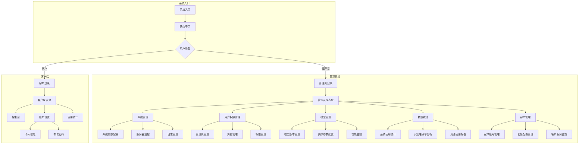
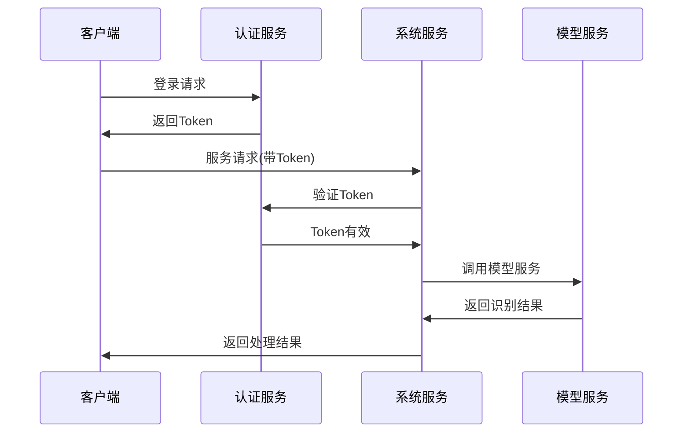

# 图像识别引擎系统架构

## 系统角色说明

### 1. 管理员
- 系统管理员：负责整个系统的配置和维护
- 可访问所有管理功能
- 管理客户账户和服务

### 2. 客户
- 系统使用者
- 可查看个人使用统计
- 管理个人账户信息

## 主要功能模块

### 管理员端

1. **系统管理**
   - 系统参数配置：调整系统运行参数
   - 服务器监控：监控服务器状态
   - 日志管理：查看系统日志

2. **用户权限管理**
   - 管理员管理：添加/删除管理员账号
   - 角色管理：定义不同角色权限
   - 权限管理：细粒度的权限控制

3. **模型管理**
   - 模型版本管理：管理不同版本的模型
   - 训练参数配置：配置模型训练参数
   - 性能监控：监控模型运行性能

4. **数据统计**
   - 系统使用统计：统计系统整体使用情况
   - 识别准确率分析：分析模型识别准确率
   - 资源使用报表：生成资源使用报告

5. **客户管理**
   - 客户账号管理：管理客户账户
   - 套餐配置管理：配置不同服务套餐
   - 客户服务监控：监控客户服务状态

### 客户端

1. **控制台**
   - 查看服务概况
   - 使用系统服务

2. **账户设置**
   - 个人信息管理
   - 密码修改

3. **使用统计**
   - 查看服务使用情况
   - 查看账户余额

## 数据流向

